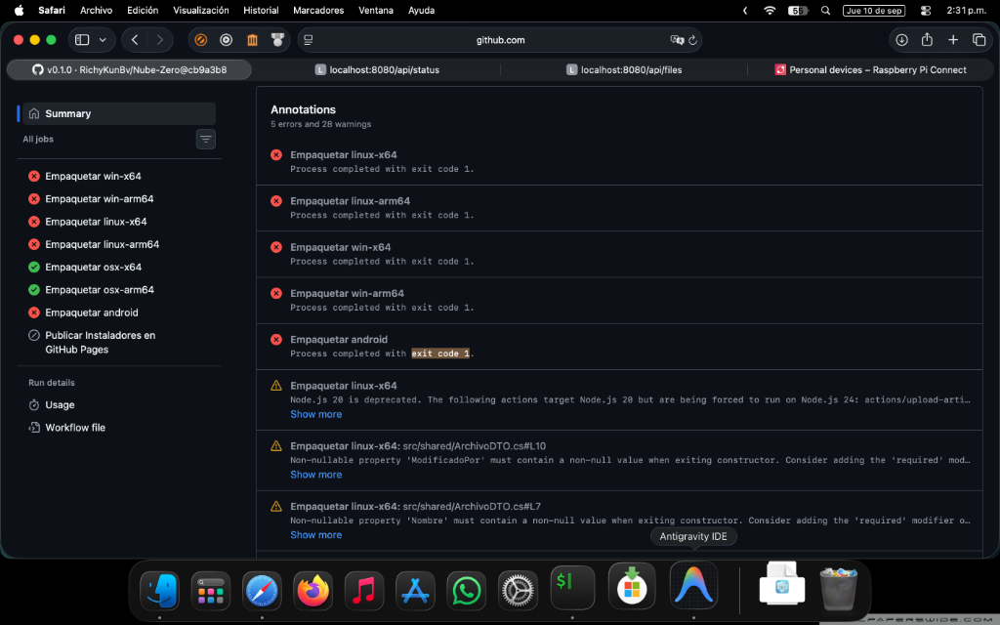

# Nube-Zero

# Configuración del Bus USB - Raspberry Pi Zero 1W (Debian Trixie Lite)

Documentación de los cambios aplicados en el sistema para corregir el problema de detección de periféricos USB en el arranque y forzar el puerto Micro-USB en modo Host.

## 1. Modificaciones en el Firmware (`/boot/firmware/config.txt`)

Se añadieron las siguientes líneas al final del archivo para obligar al kernel a inicializar el bus USB correctamente desde el encendido, evitando que el puerto se quede en modo de espera pasivo (ahorro de energía) o adivinando el rol del puerto OTG:

```text
[all]
# Cambia el controlador USB nativo al modo clásico de Broadcom forzado a Host
dtoverlay=dwc_otg,dr_mode=host

# Añade un retraso de 5 segundos al arranque para estabilizar el voltaje del bus eléctrico
boot_delay=5
```

## 2. Diagnóstico de Hardware y Solución

Tras agotar las pruebas de software, se determinó lo siguiente respecto a los componentes físicos:

* **Alimentación:** El cargador de pared ZTE de 5V a 2A y el cable PowerA proporcionan la energía y el blindaje necesarios para mantener la placa estable sin sufrir caídas de tensión.
* **Causa Raíz:** El adaptador físico Micro-USB OTG original estaba defectuoso o carecía de las líneas de datos internas (era un cable exclusivamente de carga). El pin 4 (ID) no estaba puenteado a tierra, lo que impedía que el procesador Broadcom abriera el canal de datos.
* **Solución Física:** Se reemplazó el adaptador por un adaptador OTG real con soporte de datos. El sistema reconoció de inmediato la memoria Kingston DTSE9 de 16GB, mapeándola exitosamente en el bus de bloques como `/dev/sda`.



## 3. Estado Actual del Sistema

El bus de almacenamiento ya detecta correctamente el hardware montado:

```bash
# Comando de verificación:
lsblk

# Salida esperada:
sda           8:0    1 14.5G  0 disk
├─sda1        8:1    1  200M  0 part
└─sda2        8:2    1 14.3G  0 part
```
