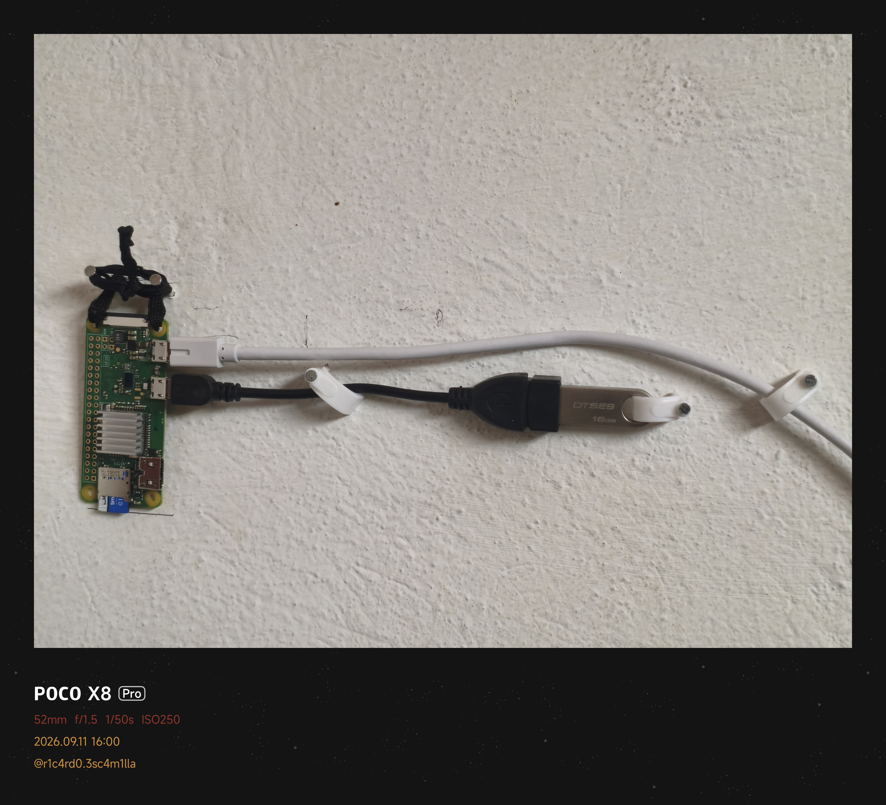
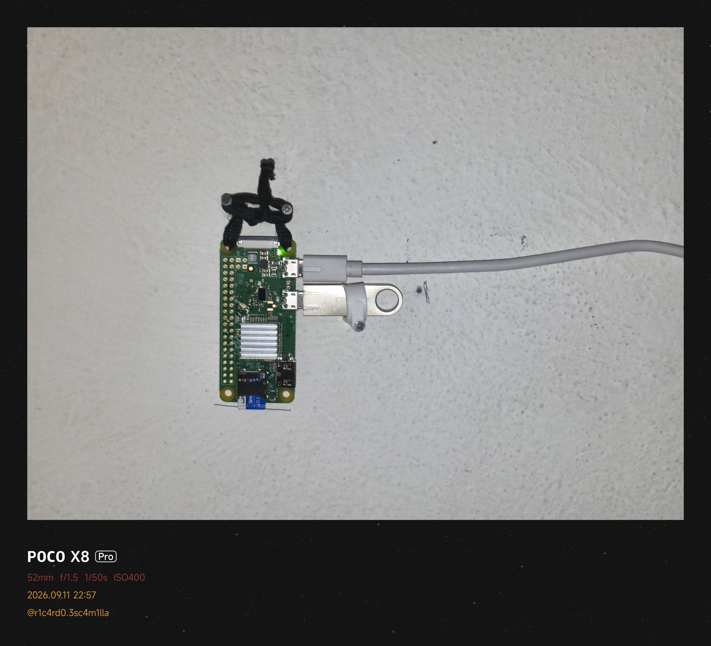

<div align="center">

# Nube-Zero ☁️

[](https://github.com/RichyKunBv/Nube-Zero)
[](https://github.com/RichyKunBv/Nube-Zero)
[](https://github.com/RichyKunBv/Nube-Zero/blob/main/LICENSE)
[](https://dotnet.microsoft.com/es-es/download/dotnet/10.0)
[](https://avaloniaui.net)

Tu solución personal de nube ligera, rápida y multiplataforma.

</div>

---

## 🚀 Instalación y Descargas

### Descargar para Cliente (Desktop & Mobile)

Nube-Zero cuenta con un cliente nativo súper rápido construido en Avalonia UI. Descarga la versión adecuada para tu sistema:

|  |  |  |
| :---: | :---: | :---: |
| [](https://github.com/RichyKunBv/Nube-Zero/releases/latest/download/NubeZero-arm64.exe) | [](https://github.com/RichyKunBv/Nube-Zero/releases/latest/download/NubeZero-arm64.dmg) | [](https://github.com/RichyKunBv/Nube-Zero/releases/latest/download/NubeZero-arm64.AppImage) |
| [](https://github.com/RichyKunBv/Nube-Zero/releases/latest/download/NubeZero-x64.exe) | [](https://github.com/RichyKunBv/Nube-Zero/releases/latest/download/NubeZero-x64.dmg) | [](https://github.com/RichyKunBv/Nube-Zero/releases/latest/download/NubeZero-x64.AppImage) |

### Servidor (Raspberry Pi / Linux)

> [!IMPORTANT]
> Para instalar, configurar o actualizar el servidor en tu Raspberry Pi o entorno Linux, **DEBES utilizar el script `setup_server.sh`**. 

El script automatizará la descarga de binarios, configuración de dependencias (Mono) y establecimiento de servicios systemd para que arranque automáticamente.

Puedes descargarlo y ejecutarlo usando:

```bash
wget https://raw.githubusercontent.com/RichyKunBv/Nube-Zero/main/setup_server.sh
sudo bash setup_server.sh
```

*(Recuerda ejecutarlo con permisos de administrador o `sudo`)*

---

## 📝 Nota de Hardware: Configuración del Bus USB - Raspberry Pi Zero 1W

Documentación de los cambios aplicados en el sistema para corregir el problema de detección de periféricos USB en el arranque y forzar el puerto Micro-USB en modo Host en Debian Trixie Lite.

### 1. Diagnóstico de Hardware y Solución

Tras agotar las pruebas de software, se determinó lo siguiente respecto a los componentes físicos:

* **Alimentación:** El cargador de pared ZTE de 5V a 2A y el cable PowerA proporcionan la energía y el blindaje necesarios para mantener la placa estable sin sufrir caídas de tensión.
* **Causa Raíz:** El adaptador físico Micro-USB OTG original estaba defectuoso o carecía de las líneas de datos internas (era un cable exclusivamente de carga). El pin 4 (ID) no estaba puenteado a tierra, lo que impedía que el procesador Broadcom abriera el canal de datos.
* **Solución Física:** Se reemplazó el adaptador por un adaptador OTG real con soporte de datos. El sistema reconoció de inmediato la memoria Kingston DTSE9 de 16GB, mapeándola exitosamente en el bus de bloques como `/dev/sda`.

### 2. Galería de Montaje

**Pre-Configuración (Cable de solo carga):**
Así estaba el montaje inicial antes de descubrir que el problema era el cable "OTG" que en realidad solo entregaba energía.


**Montaje Actual (Operativo):**
Así se encuentra operando actualmente nuestro servidor Nube-Zero, con el almacenamiento externo debidamente reconocido.


### 3. Modificaciones en el Firmware (`/boot/firmware/config.txt`)

Se añadieron las siguientes líneas al final del archivo para obligar al kernel a inicializar el bus USB correctamente desde el encendido, evitando que el puerto se quede en modo de espera pasivo (ahorro de energía) o adivinando el rol del puerto OTG:

```text
[all]
# Cambia el controlador USB nativo al modo clásico de Broadcom forzado a Host
dtoverlay=dwc_otg,dr_mode=host

# Añade un retraso de 5 segundos al arranque para estabilizar el voltaje del bus eléctrico
boot_delay=5
```

### 4. Estado Actual del Sistema

El bus de almacenamiento ya detecta correctamente el hardware montado:

```bash
# Comando de verificación:
lsblk

# Salida esperada:
sda           8:0    1 14.5G  0 disk
├─sda1        8:1    1  200M  0 part
└─sda2        8:2    1 14.3G  0 part
```
