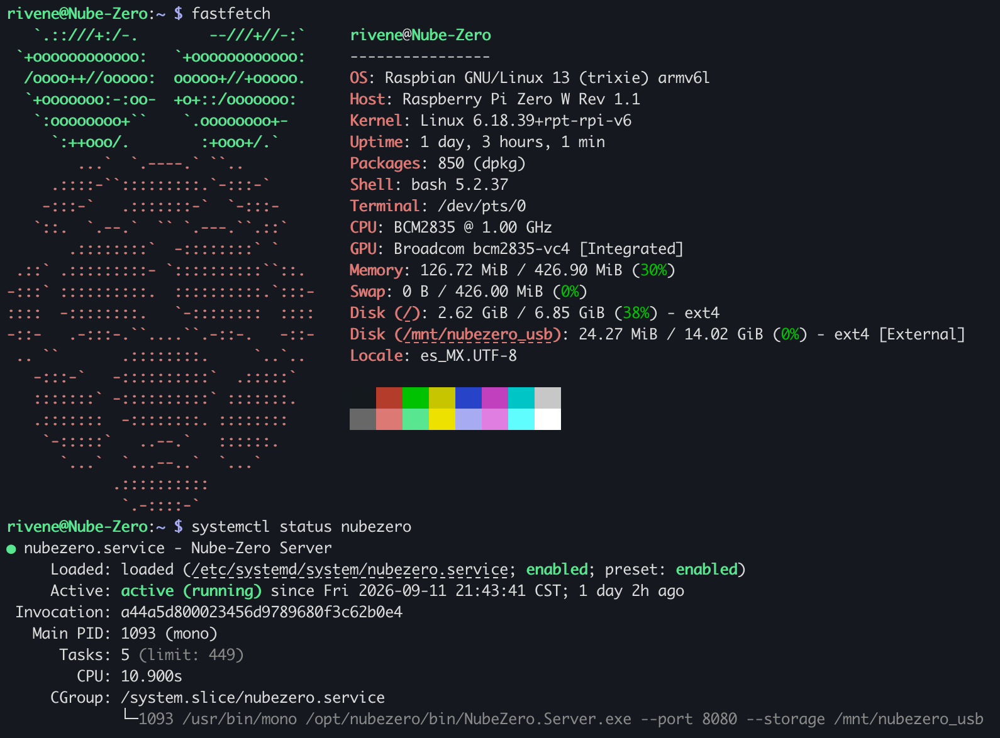

<div align="center">

# Nube-Zero ☁️

[](https://github.com/RichyKunBv/Nube-Zero)
[](https://github.com/RichyKunBv/Nube-Zero)
[](https://github.com/RichyKunBv/Nube-Zero/blob/main/LICENSE)
---
[-lightgrey.svg)](https://dotnet.microsoft.com/es-es/download/dotnet-framework/net472)
[-lightgrey.svg)](https://dotnet.microsoft.com/es-es/download/dotnet/10.0)
---
[](https://dotnet.microsoft.com/es-es/download/dotnet/10.0)
[](https://avaloniaui.net)
[](https://avaloniaui.net)
---

## 🚀 Instalación y Descargas

### Descargar para Cliente (Desktop & Mobile)

Nube-Zero cuenta con un cliente nativo súper rápido construido en Avalonia UI. Descarga la versión adecuada para tu sistema:

|  |  |  |  |
| :---: | :---: | :---: | :---: |
| [](https://github.com/RichyKunBv/Nube-Zero/releases/latest/download/NubeZero-arm64.exe) | [](https://github.com/RichyKunBv/Nube-Zero/releases/latest/download/NubeZero-arm64.dmg) | [](https://github.com/RichyKunBv/Nube-Zero/releases/latest/download/NubeZero-arm64.AppImage) | [](https://github.com/RichyKunBv/Nube-Zero/releases/latest/download/NubeZero.apk) |
| [](https://github.com/RichyKunBv/Nube-Zero/releases/latest/download/NubeZero-x64.exe) | [](https://github.com/RichyKunBv/Nube-Zero/releases/latest/download/NubeZero-x64.dmg) | [](https://github.com/RichyKunBv/Nube-Zero/releases/latest/download/NubeZero-x64.AppImage) | |

### Servidor (Raspberry Pi / Linux)

> [!IMPORTANT]
> Para instalar, configurar o actualizar el servidor en tu Raspberry Pi o entorno Linux, **DEBES utilizar el script `setup_server.sh`**. 

El script automatizará la descarga de binarios, configuración de dependencias (Mono) y establecimiento de servicios systemd para que arranque automáticamente.

Puedes descargarlo y ejecutarlo usando:

```bash
wget https://raw.githubusercontent.com/RichyKunBv/Nube-Zero/main/setup_server.sh
sudo bash setup_server.sh
```

*(Recuerda ejecutarlo con permisos de administrador o `sudo`)*

---
### Conexión Rápida por SSH (`ssh.sh`)

Para facilitarte la conexión remota a tu Raspberry Pi o servidor sin tener que recordar o escribir comandos largos de SSH cada vez, se incluye un script interactivo asistente: [`ssh.sh`](ssh.sh).

**¿Cómo usarlo?**
1. Dale permisos de ejecución al script (si aún no los tiene):
   ```bash
   chmod +x ssh.sh
   ```
2. Ejecútalo en tu terminal:
   ```bash
   ./ssh.sh
   ```
3. El asistente te solicitará tu **usuario** (por ejemplo, `pi` o tu nombre de usuario) y el **hostname/IP** (por ejemplo, `raspberrypi.local` o `192.168.1.100`).
4. Si la conexión llega a fallar o te equivocas al escribir algún dato, el script te mostrará un menú interactivo para reintentar o cambiar de usuario/IP al instante sin tener que salir ni volver a empezar.

---


## 🛡️ Blindaje y Arquitectura de Protección MicroSD y Red (`ro`)

Nube-Zero incluye una herramienta de configuración de línea de comandos para transformar tu Raspberry Pi en un appliance ultrarrápido y seguro a nivel hardware congelando la tarjeta MicroSD en modo solo lectura estricto (`ro`), redirigiendo la basura del sistema a una memoria USB por OTG y manteniendo la resolución de nombres DNS funcional.

Ejecutando el asistente interactivo:
```bash
sudo nubezero config
```

### Guía Manual / Pasos del Blindaje

#### 1. Estructura de carpetas en la memoria USB
Se crean los directorios dentro de la memoria USB (`/mnt/nubezero_usb`) para absorber las escrituras constantes y se migran los registros iniciales:
```bash
sudo mkdir -p /mnt/nubezero_usb/basurero/log
sudo mkdir -p /mnt/nubezero_usb/basurero/tmp
sudo rsync -a /var/log/ /mnt/nubezero_usb/basurero/log/
```

#### 2. Configuración de montajes (`/etc/fstab`)
En `/etc/fstab` se agrega la opción `,ro` en la partición raíz (`/`), se monta la USB por UUID y se establecen los Bind Mounts:
```text
# 1. Partición raíz de la MicroSD congelada en Solo Lectura (ro)
PARTUUID=c4f4b55e-02  /               ext4    defaults,noatime,ro  0       1

# 2. Almacenamiento secundario USB Kingston
UUID=f3ff54a0-fad3-4494-9ecc-c6aca96a748c /mnt/nubezero_usb ext4 defaults,noatime 0 2

# 3. Redirección de escrituras pesadas (Bind Mounts)
/mnt/nubezero_usb/basurero/log  /var/log  none  bind  0  0
/mnt/nubezero_usb/basurero/tmp  /tmp      none  bind  0  0
/mnt/nubezero_usb/basurero/tmp  /var/tmp  none  bind  0  0
```

#### 3. Solución a la resolución de nombres DNS
Para evitar que el bloqueo de escritura en `/etc/resolv.conf` rompa la conectividad a Internet, se enlaza el archivo DNS hacia `/tmp` (ubicado en la USB) y se definen los servidores DNS:
```bash
# Eliminar el archivo estático y crear enlace simbólico a la USB
sudo rm -f /etc/resolv.conf
sudo ln -s /tmp/resolv.conf /etc/resolv.conf

# Inyectar servidores DNS públicos directamente en la USB
echo -e "nameserver 1.1.1.1\nnameserver 8.8.8.8" | sudo tee /tmp/resolv.conf
```

#### 4. Atajos de mantenimiento (`~/.bashrc` / `/etc/bash.bashrc`)
Se agregan los alias `rw` y `ro` para modificar el estado de la MicroSD en caliente durante mantenimientos:
```bash
alias rw='sudo mount -o remount,rw / && sudo mount -o remount,rw /boot/firmware && echo "SD Desbloqueada (Modo Escritura)"'
alias ro='sudo mount -o remount,ro / && sudo mount -o remount,ro /boot/firmware && echo "SD Congelada (Solo Lectura)"'
```

#### 5. Validación del sistema
Tras reiniciar (`sudo reboot`), se puede verificar el blindaje con:
1. **Prueba de protección SD:** `sudo touch /prueba.txt` *(Esperado: Read-only file system)*
2. **Prueba de DNS:** `ping -c 2 github.com` *(Esperado: 0% pérdida)*



> [!CAUTION]
> **Recomendación de Sistema Operativo:** Estas optimizaciones de hardware modifican el núcleo de Linux, los servicios Swap, Systemd y la tabla de particiones `fstab`. Han sido **estrictamente validadas y desarrolladas en Raspberry Pi OS 13 Trixie (32-bit lite)**, que es el entorno nativo de desarrollo del proyecto. Desconocemos la estabilidad o si los comandos difieren en otras versiones de Debian (Bullseye/Bookworm) o en arquitecturas de 64-bits. Te sugerimos encarecidamente utilizar Raspbian Trixie para una experiencia libre de errores.

---

## 📝 Nota de Hardware: Configuración del Bus USB - Raspberry Pi Zero 1W

Documentación de los cambios aplicados en el sistema para corregir el problema de detección de periféricos USB en el arranque y forzar el puerto Micro-USB en modo Host en Debian Trixie Lite.

### 1. Diagnóstico de Hardware y Solución

Tras agotar las pruebas de software, se determinó lo siguiente respecto a los componentes físicos:

* **Alimentación:** El cargador de pared ZTE de 5V a 2A y el cable PowerA proporcionan la energía y el blindaje necesarios para mantener la placa estable sin sufrir caídas de tensión.
* **Causa Raíz:** El adaptador físico Micro-USB OTG original estaba defectuoso o carecía de las líneas de datos internas (era un cable exclusivamente de carga). El pin 4 (ID) no estaba puenteado a tierra, lo que impedía que el procesador Broadcom abriera el canal de datos.
* **Solución Física:** Se reemplazó el adaptador por un adaptador OTG real con soporte de datos. El sistema reconoció de inmediato la memoria Kingston DTSE9 de 16GB, mapeándola exitosamente en el bus de bloques como `/dev/sda`.

### 2. Galería de Montaje

**Pre-Configuración (Cable de solo carga):**
Así estaba el montaje inicial antes de descubrir que el problema era el cable "OTG" que en realidad solo entregaba energía.


**Montaje Actual (Operativo):**
Así se encuentra operando actualmente nuestro servidor Nube-Zero, con el almacenamiento externo debidamente reconocido.


### 3. Modificaciones en el Firmware (`/boot/firmware/config.txt`)

Se añadieron las siguientes líneas al final del archivo para obligar al kernel a inicializar el bus USB correctamente desde el encendido, evitando que el puerto se quede en modo de espera pasivo (ahorro de energía) o adivinando el rol del puerto OTG:

```text
[all]
# Cambia el controlador USB nativo al modo clásico de Broadcom forzado a Host
dtoverlay=dwc_otg,dr_mode=host

# Añade un retraso de 5 segundos al arranque para estabilizar el voltaje del bus eléctrico
boot_delay=5
```

### 4. Estado Actual del Sistema

El bus de almacenamiento ya detecta correctamente el hardware montado:

```bash
# Comando de verificación:
lsblk

# Salida esperada:
sda           8:0    1 14.5G  0 disk
├─sda1        8:1    1  200M  0 part
└─sda2        8:2    1 14.3G  0 part
```
