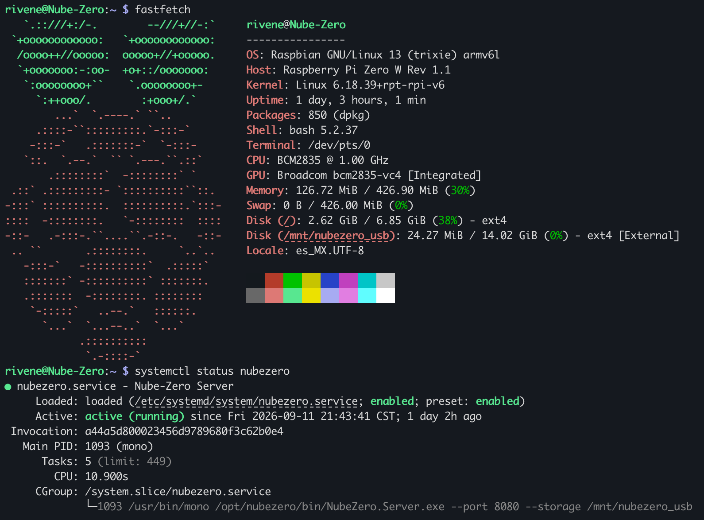
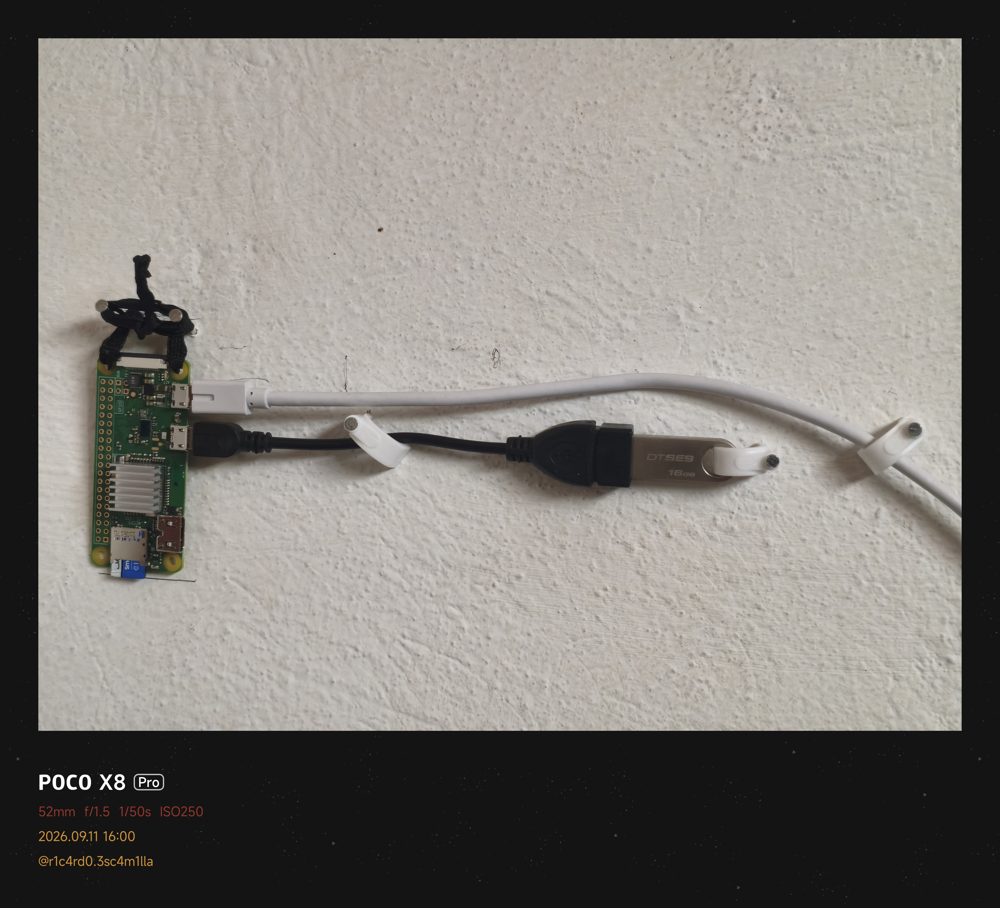
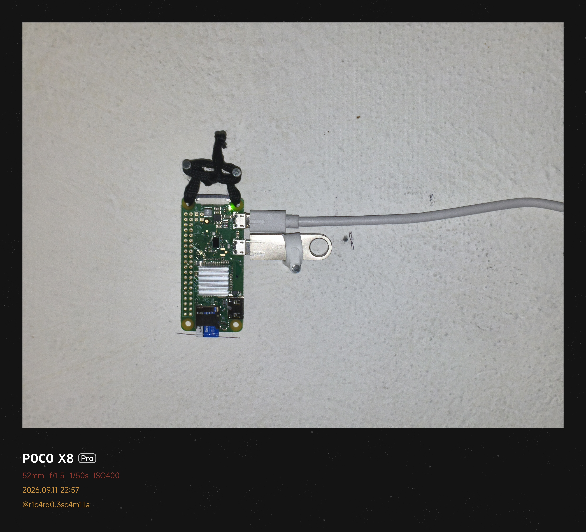

# Nube-Zero ☁️

[](https://github.com/RichyKunBv/Nube-Zero)
[](https://github.com/RichyKunBv/Nube-Zero)
[](https://github.com/RichyKunBv/Nube-Zero/blob/main/LICENSE)
---
[-lightgrey.svg)](https://dotnet.microsoft.com/es-es/download/dotnet-framework/net472)
[-lightgrey.svg)](https://dotnet.microsoft.com/es-es/download/dotnet/10.0)
---
[](https://dotnet.microsoft.com/es-es/download/dotnet/10.0)
[](https://avaloniaui.net)
[](https://avaloniaui.net)
---

## ✨ Características Principales

- 📦 **Subida de archivos grandes (v0.7.1)**: transferencias en streaming con un timeout ampliado para evitar cortes en archivos de varios cientos de MB.
- 🔐 **Recordar credenciales de forma segura (v0.7.1)**: opción para guardar la contraseña en el almacenamiento seguro de Android o en el llavero de macOS y recuperar la sesión al volver a abrir la aplicación.
- 📥 **Descargas Android más fiables (v0.7.1)**: selector nativo para guardar directamente en Descargas u otra ubicación, sin depender del menú Compartir del fabricante.
- 🔄 **Actualización desde el cliente (v0.7.1)**: comprueba GitHub y abre el instalador de la plataforma; en Android descarga el APK y solicita confirmación al instalador del sistema.
- 📏 **Tamaños de archivo claros**: la interfaz etiqueta KiB/MiB/GiB para indicar explícitamente que convierte usando base 1024.
- 📊 **Transferencias más claras y seguras (v0.7.4)**: progreso de subida/descarga, cola FIFO compartida para limitar a una transferencia activa, sesiones extendidas durante operaciones largas y publicación de archivos solo después de verificar su recepción completa.
- 🔐 **Seguridad de transporte y archivos (v0.7.5)**: HTTPS obligatorio con certificado local fijado por huella SHA-256, cifrado autenticado en streaming desde los clientes y almacenamiento de archivos cifrados en el servidor. Las contraseñas usan PBKDF2-SHA256 con sal y las sesiones usan tokens aleatorios.
- 🔁 **Conexión más sencilla (v0.7.6)**: los clientes recuerdan la URL del servidor y la huella SHA-256 verificada al cerrar la aplicación, para que no tengas que volver a introducirlas. Cerrar sesión elimina las credenciales y conserva esos datos de conexión. La contraseña solo se guarda si eliges recordarla y se almacena en el mecanismo seguro de la plataforma.
- 🧰 **Diagnóstico y empaquetado de clientes (v0.7.7)**: los errores HTTP durante la conexión muestran el detalle devuelto por el servidor, incluyendo fallos al cargar la clave o los archivos. El empaquetado de macOS prepara por sí mismo los bundles e identifica correctamente el ejecutable de la aplicación.
- 🌐 **Compatibilidad del proxy HTTPS (v0.7.8)**: el servidor acepta el encabezado `Host` público reenviado por stunnel y conserva el acceso al puerto HTTP interno restringido a conexiones locales.
- 🗂️ **Navegación y vistas previas (v0.7.4)**: navegación por carpetas, iconos por tipo y miniaturas de imágenes generadas y cacheadas en los clientes. Los primeros fotogramas de video se generan localmente para clips de hasta 32 MiB; en escritorio se requiere `ffmpeg` disponible en el sistema.
- 🔍 **Descubrimiento Automático Silencioso (v0.6.0)**: Encuentra tus servidores Nube-Zero en la red local bajo demanda con un solo clic (`🔍`). Funciona mediante un protocolo reactivo *Probe-Response* por UDP con clave de autenticación: **cero saturación de Wi-Fi, cero pings continuos y 0% de uso de CPU en reposo**.
- 🏷️ **Soporte Multi-servidor y Nombres Personalizados**: Cada Raspberry Pi puede tener su propio nombre identificador (`--name "Mi Servidor"`), facilitando elegir entre múltiples servidores desde la pantalla de inicio de los clientes.
- 👥 **Sistema de Roles y Usuarios Granular (v0.5.0)**:
  - **Admin**: Control total, creación y eliminación de usuarios, gestión de accesos.
  - **Estándar**: Subida, descarga, navegación y eliminación de archivos.
  - **Visitante**: Modo solo lectura/descarga, ideal para invitados o consultas temporales.
- 🛡️ **Blindaje MicroSD Solo Lectura (`ro`)**: Protección contra corrupción por apagones y cero desgaste de la tarjeta de memoria, enviando escrituras y logs pesados a una memoria USB por OTG.
- 🪶 **Monoproceso Ultra Ligero**: Todo el daemon corre en un único proceso en C# nativo sobre Mono (`net472`), diseñado meticulosamente para el hardware limitado de la Raspberry Pi Zero (W / 2 W) de 512 MB de RAM.

---

## 🚀 Instalación y Descargas

### Descargar para Cliente (Desktop & Mobile)

Nube-Zero cuenta con un cliente nativo súper rápido construido en Avalonia UI. Descarga la versión adecuada para tu sistema:

|  |  |  |  |
| :---: | :---: | :---: | :---: |
| [](https://github.com/RichyKunBv/Nube-Zero/releases/latest/download/NubeZero-arm64.exe) | [](https://github.com/RichyKunBv/Nube-Zero/releases/latest/download/NubeZero-arm64.dmg) | [](https://github.com/RichyKunBv/Nube-Zero/releases/latest/download/NubeZero-arm64.AppImage) | [](https://github.com/RichyKunBv/Nube-Zero/releases/latest/download/NubeZero.apk) |
| [](https://github.com/RichyKunBv/Nube-Zero/releases/latest/download/NubeZero-x64.exe) | [](https://github.com/RichyKunBv/Nube-Zero/releases/latest/download/NubeZero-x64.dmg) | [](https://github.com/RichyKunBv/Nube-Zero/releases/latest/download/NubeZero-x64.AppImage) | |

La firma Android no requiere licencia de pago. Ejecuta `bash scripts/build/generate_android_signing_key.sh` para crear un keystore privado fuera del repositorio; después configura `ANDROID_KEYSTORE_BASE64`, `ANDROID_KEYSTORE_PASSWORD`, `ANDROID_KEY_ALIAS` y `ANDROID_KEY_PASSWORD` en GitHub Actions y conserva ese keystore para todos los releases. Para macOS, si no configuras `MACOS_CERTIFICATE_BASE64`, `MACOS_CERTIFICATE_PASSWORD` y `MACOS_CODESIGN_IDENTITY`, CI usará firma ad-hoc gratuita; macOS puede mostrar advertencias y pedir autorización al abrir la app. Con Developer ID esos avisos se reducen, pero requiere el programa de Apple. La identidad del bundle permanece como `com.esmesolutions.nubezero`.

### Servidor (Raspberry Pi / Linux)

> [!IMPORTANT]
> Para instalar, configurar o actualizar el servidor en tu Raspberry Pi o entorno Linux, **DEBES utilizar el script `setup_server.sh`**. 

El script automatizará la descarga de binarios, configuración de dependencias (Mono) y establecimiento de servicios systemd para que arranque automáticamente.

Puedes descargarlo y ejecutarlo usando:

```bash
wget https://raw.githubusercontent.com/RichyKunBv/Nube-Zero/main/setup_server.sh
sudo bash setup_server.sh
```

*(Recuerda ejecutarlo con permisos de administrador o `sudo`)*

El asistente solicitará un **nombre identificador** (por ejemplo, *PiZero-Sala*), el puerto HTTPS público y, durante una instalación nueva, una contraseña de administrador de al menos 12 caracteres. También generará una clave aleatoria de cifrado de 32 bytes y la mostrará una sola vez.

En la primera conexión, introduce la huella SHA-256 que el instalador muestra al final y verifícala por SSH antes de confiar en ella. No aceptes una huella enviada únicamente por la propia conexión de red.

Después de verificarla, los clientes recuerdan la URL y la huella en el dispositivo para las siguientes aperturas. Esta comodidad no sustituye la verificación inicial: si reinstalas la aplicación, cambias de dispositivo o borras sus datos, tendrás que introducir de nuevo la huella verificada.

**La clave de cifrado es administrada por el servidor y se entrega a usuarios autenticados por HTTPS fijado** para que sus clientes cifren y descifren archivos localmente. Esto no es cifrado de extremo a extremo (E2E): el servidor administra la clave y podría leer los archivos. Protege y respalda la clave que el instalador muestra una sola vez; perderla o cambiarla hace irrecuperables los archivos. En el primer inicio de la versión nueva, el servidor migra automáticamente los archivos existentes a formato cifrado; mantén una copia de seguridad y espacio libre suficiente. Los clientes anteriores que no soporten HTTPS fijado y el formato nuevo no podrán conectarse ni leer los archivos.

El servicio de aplicación escucha únicamente en `127.0.0.1`; `stunnel` publica HTTPS en el puerto elegido. No expongas el puerto interno `8081`. Las credenciales iniciales se solicitan durante la instalación y se eliminan del archivo de entorno después de crear la cuenta. En instalaciones antiguas que todavía usen `admin/admin`, la actualización revoca esa contraseña y muestra una clave de recuperación aleatoria en el log del servicio; consúltalo localmente con `sudo journalctl -u nubezero` y cámbiala al iniciar sesión.

#### Actualizar una instalación existente

Antes de actualizar, respalda `database.json`, todo el directorio `Storage` y la clave de cifrado. La primera ejecución de la nueva versión migra los archivos existentes y puede tardar; asegúrate de tener espacio libre suficiente. No interrumpas el servicio durante esa migración. Si el servidor no vuelve a iniciar, revisa `sudo systemctl status nubezero --no-pager` y `sudo journalctl -u nubezero -n 80 --no-pager` antes de reintentar.

Para actualizar desde el dispositivo, ejecuta `sudo nubezero -u` y elige la actualización del servidor. La actualización conserva el almacenamiento externo configurado, incluyendo la ruta USB entre comillas en `ExecStart`, y permite al servicio escribir en ese punto de montaje bajo las restricciones de systemd. Al conectar una USB existente desde la CLI, esta asigna la base de datos, los archivos de `Storage` y el marcador de cifrado a la cuenta del servicio; no cambia el propietario del resto del dispositivo. La CLI informa si falla la descarga del instalador o del paquete, si el script descargado no pasa la comprobación de sintaxis o si la instalación termina con error. Una actualización fallida no garantiza rollback automático: conserva el respaldo para poder recuperar los datos. Para actualizar solo la CLI, usa `sudo nubezero update-cli`.

#### Contraseña de administrador desde la CLI

Ejecuta `sudo nubezero -c` y selecciona la opción **11** para mostrar la contraseña inicial temporal que aún esté configurada o la última contraseña de recuperación que haya quedado registrada en los logs del servicio. Esa opción no puede recuperar contraseñas guardadas únicamente como hash. Si no encuentra una contraseña temporal/de recuperación, usa la opción **6** para establecer una nueva contraseña. Trata cualquier contraseña mostrada como un secreto y cámbiala después de iniciar sesión.

---
### Conexión Rápida por SSH (`ssh.sh`)

Para facilitarte la conexión remota a tu Raspberry Pi o servidor sin tener que recordar o escribir comandos largos de SSH cada vez, se incluye un script interactivo asistente: [`ssh.sh`](ssh.sh).

**¿Cómo usarlo?**
1. Dale permisos de ejecución al script (si aún no los tiene):
   ```bash
   chmod +x ssh.sh
   ```
2. Ejecútalo en tu terminal:
   ```bash
   ./ssh.sh
   ```
3. El asistente te solicitará tu **usuario** (por ejemplo, `pi` o tu nombre de usuario) y el **hostname/IP** (por ejemplo, `raspberrypi.local` o `192.168.1.100`).
4. Si la conexión llega a fallar o te equivocas al escribir algún dato, el script te mostrará un menú interactivo para reintentar o cambiar de usuario/IP al instante sin tener que salir ni volver a empezar.

---


## 🛡️ Blindaje y Arquitectura de Protección MicroSD y Red (`ro`)

Nube-Zero incluye una herramienta de configuración de línea de comandos para transformar tu Raspberry Pi en un appliance ultrarrápido y seguro a nivel hardware congelando la tarjeta MicroSD en modo solo lectura estricto (`ro`), redirigiendo la basura del sistema a una memoria USB por OTG y manteniendo la resolución de nombres DNS funcional.

Ejecutando el asistente interactivo:
```bash
sudo nubezero config
```

### Guía Manual / Pasos del Blindaje

#### 1. Estructura de carpetas en la memoria USB
Se crean los directorios dentro de la memoria USB (`/mnt/nubezero_usb`) para absorber las escrituras constantes y se migran los registros iniciales:
```bash
sudo mkdir -p /mnt/nubezero_usb/basurero/log
sudo mkdir -p /mnt/nubezero_usb/basurero/tmp
sudo rsync -a /var/log/ /mnt/nubezero_usb/basurero/log/
```

#### 2. Configuración de montajes (`/etc/fstab`)
En `/etc/fstab` se agrega la opción `,ro` en la partición raíz (`/`), se monta la USB por UUID y se establecen los Bind Mounts:
```text
# 1. Partición raíz de la MicroSD congelada en Solo Lectura (ro)
PARTUUID=c4f4b55e-02  /               ext4    defaults,noatime,ro  0       1

# 2. Almacenamiento secundario USB Kingston
UUID=f3ff54a0-fad3-4494-9ecc-c6aca96a748c /mnt/nubezero_usb ext4 defaults,noatime 0 2

# 3. Redirección de escrituras pesadas (Bind Mounts)
/mnt/nubezero_usb/basurero/log  /var/log  none  bind  0  0
/mnt/nubezero_usb/basurero/tmp  /tmp      none  bind  0  0
/mnt/nubezero_usb/basurero/tmp  /var/tmp  none  bind  0  0
```

#### 3. Solución a la resolución de nombres DNS
Para evitar que el bloqueo de escritura en `/etc/resolv.conf` rompa la conectividad a Internet, se enlaza el archivo DNS hacia `/tmp` (ubicado en la USB) y se definen los servidores DNS:
```bash
# Eliminar el archivo estático y crear enlace simbólico a la USB
sudo rm -f /etc/resolv.conf
sudo ln -s /tmp/resolv.conf /etc/resolv.conf

# Inyectar servidores DNS públicos directamente en la USB
echo -e "nameserver 1.1.1.1\nnameserver 8.8.8.8" | sudo tee /tmp/resolv.conf
```

#### 4. Atajos de mantenimiento (`~/.bashrc` / `/etc/bash.bashrc`)
Se agregan los alias `rw` y `ro` para modificar el estado de la MicroSD en caliente durante mantenimientos:
```bash
alias rw='sudo mount -o remount,rw / && sudo mount -o remount,rw /boot/firmware && echo "SD Desbloqueada (Modo Escritura)"'
alias ro='sudo mount -o remount,ro / && sudo mount -o remount,ro /boot/firmware && echo "SD Congelada (Solo Lectura)"'
```

#### 5. Validación del sistema
Tras reiniciar (`sudo reboot`), se puede verificar el blindaje con:
1. **Prueba de protección SD:** `sudo touch /prueba.txt` *(Esperado: Read-only file system)*
2. **Prueba de DNS:** `ping -c 2 github.com` *(Esperado: 0% pérdida)*



> [!CAUTION]
> **Recomendación de Sistema Operativo:** Estas optimizaciones de hardware modifican el núcleo de Linux, los servicios Swap, Systemd y la tabla de particiones `fstab`. Han sido **estrictamente validadas y desarrolladas en Raspberry Pi OS 13 Trixie (32-bit lite)**, que es el entorno nativo de desarrollo del proyecto. Desconocemos la estabilidad o si los comandos difieren en otras versiones de Debian (Bullseye/Bookworm) o en arquitecturas de 64-bits. Te sugerimos encarecidamente utilizar Raspbian Trixie para una experiencia libre de errores.

---

## 📝 Nota de Hardware: Configuración del Bus USB - Raspberry Pi Zero 1W

Documentación de los cambios aplicados en el sistema para corregir el problema de detección de periféricos USB en el arranque y forzar el puerto Micro-USB en modo Host en Debian Trixie Lite.

### 1. Diagnóstico de Hardware y Solución

Tras agotar las pruebas de software, se determinó lo siguiente respecto a los componentes físicos:

* **Alimentación:** El cargador de pared ZTE de 5V a 2A y el cable PowerA proporcionan la energía y el blindaje necesarios para mantener la placa estable sin sufrir caídas de tensión.
* **Causa Raíz:** El adaptador físico Micro-USB OTG original estaba defectuoso o carecía de las líneas de datos internas (era un cable exclusivamente de carga). El pin 4 (ID) no estaba puenteado a tierra, lo que impedía que el procesador Broadcom abriera el canal de datos.
* **Solución Física:** Se reemplazó el adaptador por un adaptador OTG real con soporte de datos. El sistema reconoció de inmediato la memoria Kingston DTSE9 de 16GB, mapeándola exitosamente en el bus de bloques como `/dev/sda`.

### 2. Galería de Montaje

**Pre-Configuración (Cable de solo carga):**
Así estaba el montaje inicial antes de descubrir que el problema era el cable "OTG" que en realidad solo entregaba energía.


**Montaje Actual (Operativo):**
Así se encuentra operando actualmente nuestro servidor Nube-Zero, con el almacenamiento externo debidamente reconocido.


### 3. Modificaciones en el Firmware (`/boot/firmware/config.txt`)

Se añadieron las siguientes líneas al final del archivo para obligar al kernel a inicializar el bus USB correctamente desde el encendido, evitando que el puerto se quede en modo de espera pasivo (ahorro de energía) o adivinando el rol del puerto OTG:

```text
[all]
# Cambia el controlador USB nativo al modo clásico de Broadcom forzado a Host
dtoverlay=dwc_otg,dr_mode=host

# Añade un retraso de 5 segundos al arranque para estabilizar el voltaje del bus eléctrico
boot_delay=5
```

### 4. Estado Actual del Sistema

El bus de almacenamiento ya detecta correctamente el hardware montado:

```bash
# Comando de verificación:
lsblk

# Salida esperada:
sda           8:0    1 14.5G  0 disk
├─sda1        8:1    1  200M  0 part
└─sda2        8:2    1 14.3G  0 part
```

---

### Requisitos minimos para los clientes
### Windows
* Windows 10 21H2 o superior
* Windows 11 21H2 o superior

### macOS
* macOS 15 (Sequoia) o superior

### Linux
* Debian 13 o superior
* Fedora 43 o superior
* openSUSE Leap 16.0 o superior
* Red Hat Enterprise Linux	8 o superior
* SUSE Linux Enterprise	15.7 o superior
* Ubuntu	22.04 o superior

### Android
* Android 14 o superior

---

## ⚠️ Aviso de Ciclo de Vida y Soporte de Hardware (Pi Zero W)

> [!WARNING]
> **Fin de prioridad para la arquitectura ARMv6 (32 bits)**
>
> A partir de **enero de 2028**, el desarrollo de Nube-Zero dejará de priorizar la compatibilidad con la **Raspberry Pi Zero W original** (y hardware ARMv6 de 32 bits equivalente). 
> 
> A partir de esa fecha, el requisito mínimo oficial de hardware recomendado pasará a ser la **Raspberry Pi Zero 2 W** (o superior), migrando el núcleo del servidor de forma definitiva hacia **.NET nativo de 64 bits (ARM64)** sobre sistemas operativos modernos.

### ¿Por qué esta decisión?
**Seguridad del Sistema Operativo:** El sistema operativo base para esta placa (Raspberry Pi OS 13 / Debian Trixie) finalizará su soporte estándar de seguridad a mediados de 2028, dejando al servidor expuesto a vulnerabilidades de red.

*Nota: Las versiones de Nube-Zero optimizadas para Mono (`net472`) publicadas antes de enero de 2028 permanecerán disponibles en el historial de Releases para su uso local en modo congelado ("appliance"), pero no recibirán nuevas funciones ni parches.*


## ⚠️ Aviso de Ciclo de Vida y Soporte del Cliente (macOS Intel)

> [!WARNING]
> **Fin del empaquetado para arquitectura Intel x64 en macOS**
>
> Por políticas de estabilidad y seguridad, el desarrollo del cliente de Nube-Zero migra exclusivamente de versión LTS en LTS de .NET. Al realizar la transición planificada hacia **.NET 12 (LTS)** a finales de 2027, **se dejará de compilar y distribuir oficialmente la versión `osx-x64` para macOS**. 

### ¿Por qué esta decisión?
* **Regla de las 3 últimas versiones:** Microsoft alinea el SDK de .NET con el ciclo de soporte de Apple. Con el lanzamiento teórico de macOS 28 en 2027, los tres sistemas operativos soportados activamente por el ecosistema serán plataformas optimizadas de forma nativa y exclusiva para Apple Silicon (ARM64).
* **Bloqueo del Compilador:** Al remover Apple las librerías de enlace heredadas en Xcode y las imágenes virtuales de integración continua, el entorno automatizado de GitHub Actions perderá la capacidad técnica de compilar binarios `osx-x64` estables basados en el runtime de .NET 12.

*Nota: Los usuarios de Macs con procesadores Intel antiguos podrán seguir utilizando de forma indefinida las versiones cliente basadas en .NET 10, pero no podrán actualizar a funciones del ecosistema de .NET 12. (una disculpa pero no puedo estar sobre una version que se quede sin soporte ya que seria un riesgo para su seguridad ya que es una Nube donde pueden subir su informacion importante y privada (datos que no recopilo ya que valoro la seguridad) asi que sera necesario actualizar el lenguaje)*
